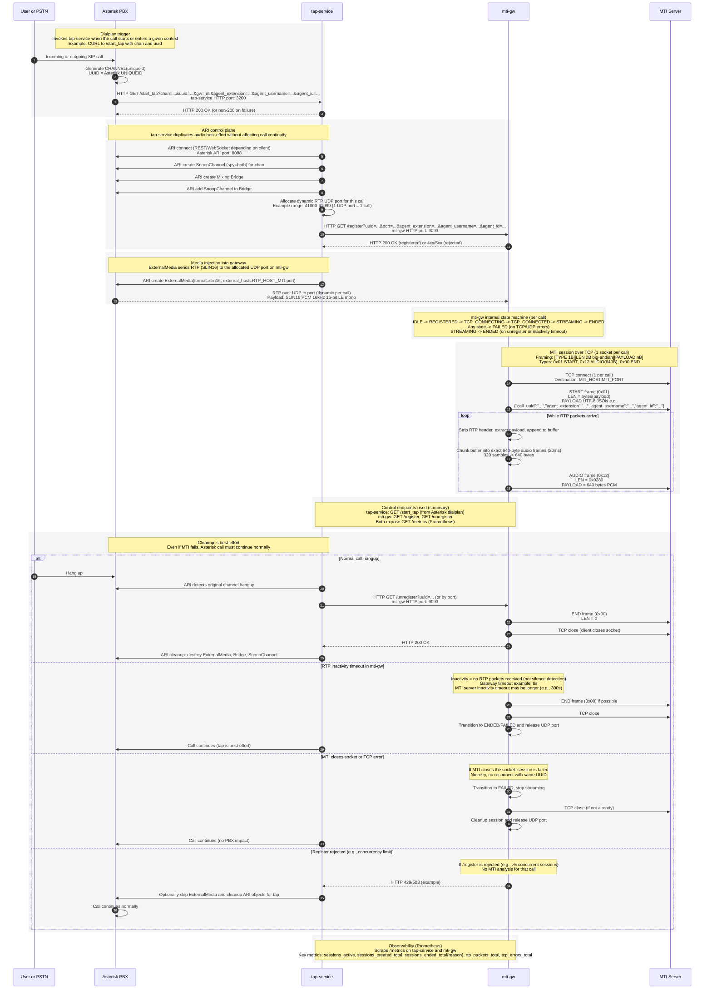

# MTI Mediagateway
### Asterisk → MTI Gateway → MTI Server (Prometheus + Grafana)

This project provides a fully containerized system that allows **tapping live calls from Asterisk**, routing audio to:

- **MTI** (custom TCP-based STT service)

…while exposing **full observability via Prometheus + Grafana**.

The system is:

- **Non-intrusive** → uses ARI snoops; the existing call path is untouched  
- **Pluggable** → freely choose STT engine per call  
- **Observable** → dashboards included

---

# 📁 Repository Structure

```text
.
├── asterisk
│   └── extensions.conf          # Sample Asterisk dialplan for tap integration
├── docker-compose.yml           # Full stack: TAP + Deepgram-GW + MTI-GW + Prometheus + Grafana
├── docs
│   └── grafana
│       ├── Deepgram-GW.json     # Deepgram gateway detailed dashboard
│       └── STT-Overview.json    # Combined STT overview dashboard
├── gw-package.json              # Dependencies template for gateway containers
├── prometheus
│   └── prometheus.yml           # Prometheus scrape configuration
├── public
│   └── widget.html              # Browser-side transcription widget
├── server
│   ├── mti-debug-server.js      # Local fake MTI server for debugging the MTI flow
│   ├── mti-gw.js                # RTP→MTI TCP gateway + metrics
│   ├── tap-service.js           # Asterisk ARI tap logic + ExternalMedia + routing + metrics
|   └── ari
|       └── ari-client.js        # A custom native ARI adapter
└── tap-package.json             # Dependencies template for tap-service
```

---

# 🧩 High-Level Architecture

## 🔶 MTI Path

`Asterisk → TAP → mti-gw → TCP framing → MTI server`

1.  TAP creates **one snoop (both)** and one external RTP channel.
    
2.  TAP allocates a **dynamic UDP port** and registers it at mti-gw.
    
3.  mti-gw:
    
    -   Binds UDP on that port
        
    -   Frames SLIN16 as START (0x01), AUDIO (0x12), END (0x00)
        
    -   Sends it to MTI via TCP
       

### New START frame payload (JSON UTF-8):
```text
{
  "call_uuid": "<asterisk-uniqueid>",
  "agent_extension": "<exten>",
  "agent_username": "<string>",
  "agent_id": "<string>"
}
```
 

You can test the protocol using:

`node server/mti-debug-server.js`

---

# 🔌 ARI Client Implementation

This project **no longer uses `node-ari-client`**.

A custom **native ARI adapter** is now implemented in:
`server/ari/ari-client.js`


### Why this change?

Some Asterisk deployments (e.g. iVoz / proxied setups) expose ARI under an
**HTTP prefix**, for example:
`http://<host>:8088/asterisk`


The swagger-based `node-ari-client` **breaks in these scenarios** because it
cannot correctly resolve prefixed ARI paths.

### What is used instead?

The TAP service now uses a **minimal native ARI adapter** based on:

- ARI REST (HTTP)
- ARI Events WebSocket (WS)

This adapter:

- Preserves **any HTTP prefix** (`/asterisk`)
- Does **not depend on swagger**
- Keeps the **same API surface** used by `tap-service`
  (`snoopChannel`, `externalMedia`, `Bridge`, `on(Stasis*)`, etc.)

No changes are required in the Asterisk dialplan.

### ARI WebSocket endpoint differences (DEV / PRO)

Depending on the Asterisk configuration, the ARI **WebSocket endpoint may differ**:

| Environment | Working WS endpoint |
|------------|---------------------|
| DEV        | `/ari/events`       |
| PRO        | `/ws`               |

Examples:

DEV: `ws://<host>:8088/ari/events?app=deitu-mti-tap&api_key=user:pass`

PRO (with HTTP prefix): `ws://<host>:8088/asterisk/ws?app=deitu-mti-tap&api_key=user:pass`


The ARI adapter **auto-detects and builds the correct WS URL** based on
`ARI_URL`, so **no environment-specific code changes are required**.

---

# 📊 Observability (Prometheus + Grafana)

## Prometheus

Runs at:

`http://<host>:9090`

Scrapes metrics from:

-   deepgram-gw
    
-   tap-service
    
-   mti-gw
    
-   itself
    

## Grafana

Runs at:

`http://<host>:3000`

Import dashboards from `docs/grafana/`:

-   `STT-Overview.json` → combined view
    
-   `Deepgram-GW.json` → detailed view
    

### Important Metrics

**TAP**

-   `tap_sessions_active`
    
-   `tap_em_channels_active{gw,dir}`
    
-   `tap_gateway_http_errors_total{gw,op}`
    
-   `tap_errors_total{place,gw}`
    
-   `tap_mti_ports_in_use`
    

**MTI-GW**

-   `mti_sessions_active`
    
-   `mti_rtp_packets_total`
    
-   `mti_tcp_errors_total`
    
-   `mti_sessions_ended_total{reason}`

# ⚙️ Environment Variables (`.env`)

Create `.env` in the project root:
## Asterisk ARI
ARI_URL=http://192.168.1.66:8088
ARI_USER=poctest
ARI_PASS=your_ari_password
TAP_APP_NAME=deitu-mti-tap
TAP_HTTP_PORT=3200

## TAP → MTI RTP dynamic range
RTP_HOST_MTI=192.168.1.65
MTI_RTP_START=41000
MTI_RTP_END=41999

## Widget hosted by deepgram-gw
WIDGET_PORT=8080

## Endianness / testing
SWAP_ENDIAN=1
DUMP_WAV=0

### Audio integrity validation (important)

During end‑to‑end (E2E) tests with a real MTI client we observed that audio was:

- Received continuously (no RTP loss)
- Correct frame rate (~50 fps)
- Correct byte volume
- But **audibly corrupted** (noise / vibratory signal, voice barely intelligible)

After deep inspection of RTP payloads, TCP captures and WAV reconstruction, the root cause was identified as **PCM endianness mismatch**.

The audio stream is:
- PCM SLIN16
- 16 kHz
- Mono

However, sample byte order required swapping before forwarding to MTI.

To solve this, `mti-gw` now supports **explicit byte‑swap** using:

```env
SWAP_ENDIAN=1
```

When enabled, each 16‑bit PCM sample is swapped before being sent downstream.

Once enabled, E2E audio became **fully intelligible and clean**.

### How to validate audio with mti-debug-server

The `mti-debug-server.js` utility is a standalone Node.js application that simulates the MTI TCP endpoint and allows **raw audio inspection**.

#### 1. Run the debug server

```bash
node mti-debug-server.js
```

It will listen on:

```
0.0.0.0:9092
```

#### 2. Point mti-gw to the debug server

Configure mti-gw to connect to the debug server IP and port (9092).

#### 3. Capture raw audio

For each call, the debug server will dump a `.raw` file containing PCM audio:

```
mti-__call_uuid__...__.raw
```

#### 4. Convert RAW → WAV

Use ffmpeg to convert and listen:

```bash
ffmpeg -f s16le -ar 16000 -ac 1 input.raw output.wav
```

You can then play the WAV file with any audio player.

If audio sounds noisy or distorted, check:

- `SWAP_ENDIAN` value
- Sample rate (must be 16000 Hz)
- That no additional transcoding is applied

This validation method was used to confirm full E2E correctness before MTI pilot tests.

### Audio integrity validation (important)

During E2E tests with a real MTI client we observed that audio was:
- Present at correct rate (50 fps, 640 bytes / frame)
- Correct duration and volume
- But **audibly corrupted** (noise / vibration / low intelligibility)

After inspecting RTP payloads, TCP frames and reconstructed WAV files, the root cause was identified as **PCM endianness mismatch**.

#### Root cause

- Asterisk sends audio as **SLIN16 little‑endian**
- MTI protocol expects **little‑endian PCM**
- Initial gateway implementation forwarded samples without swapping
- On some paths the byte order was effectively reversed, producing noise

#### Fix

`mti-gw` now supports explicit endian swapping using:

```
SWAP_ENDIAN=1
```

When enabled, every 16‑bit sample is byte‑swapped **before** being sent over TCP.

This aligns MTI with Deepgram behaviour and restores perfect audio quality.

---

### How to validate audio using `mti-debug-server`

`mti-debug-server.js` is a **standalone Node.js tool** (not part of the stack) used to:
- Accept MTI TCP connections
- Collect metrics (FPS, gaps, duration)
- Dump **raw PCM audio** exactly as received

#### 1. Run the debug server

```
node mti-debug-server.js
```

It listens on `0.0.0.0:9092` by default.

#### 2. Point `mti-gw` to the debug server

```
MTI_HOST=<debug-server-ip>
MTI_PORT=9092
```

#### 3. Make a test call

On call end, the server will generate a file like:

```
mti-__call_uuid__...__.raw
```

This file is **pure PCM s16le 16 kHz mono**.

#### 4. Convert RAW → WAV

```
ffmpeg -f s16le -ar 16000 -ac 1 -i "archivo.raw" "archivo.wav"
```

If audio is correct:
- Voice is clear
- No vibration or noise
- Normal telephony spectrum (300–3400 Hz)

This method validates the full chain:
**Asterisk → tap-service → mti-gw → MTI TCP**

## MTI
MTI_HOST=127.0.0.1
MTI_PORT=9092
MTI_GW_HTTP_PORT=9093

---

# Complete Secuence Diagram



---

# 📞 Asterisk Integration

See:

`asterisk/extensions.conf`

Contains a **real working example**:

-   Generates call UUID from `${UNIQUEID}`
    
-   Calls `/start_tap` via `CURL()`
    
-   Passes caller info, extension, metadata
    
-   Continues your call flow normally after tapping
    

This file is **a template**, not a mandatory dialplan.

---

# ▶️ Running the Full Stack

From repo root:

`docker compose up -d --build`

Check logs:

`docker compose logs -f`

## Services

| Service     | URL                     |
|-------------|--------------------------|
| TAP         | http://\<host\>:3200     |
| MTI-GW      | http://\<host\>:9093     |
| Prometheus  | http://\<host\>:9090     |
| Grafana     | http://\<host\>:3000     |

---

# 🧪 MTI Debug Server

Start:

`node server/mti-debug-server.js`

Shows:

-   START frames
    
-   AUDIO frames (size 640 = 20ms)
    
-   END frames
    
-   Connection lifecycle
    

Helpful to test mti-gw end-to-end.

## 🔊 Audio validation and endianness

During recent end‑to‑end (E2E) tests we detected that audio was **being received correctly** but sounded distorted, noisy or vibratory when reconstructed from RTP/TCP captures.
After deep analysis of RTP payloads, WAV reconstruction and spectrograms, the root cause was identified as a **PCM endianness mismatch**.

### Audio format

- Codec: **SLIN16 / PCM signed 16‑bit**
- Sample rate: **16 kHz** (not 8 kHz)
- Channels: **Mono**

### Endianness issue

Although the audio content was correct, the byte order of PCM samples required swapping.
Once endianness was corrected, audio became perfectly intelligible.

This behavior is similar to what was previously observed in the Deepgram ASR PoC, where the following environment variable was required:

```
SWAP_ENDIAN=1
```

The same logic has now been applied to **mti-gw**, so audio is sent in the expected format.

## 🛠️ How to validate audio with mti-debug-server

`mti-debug-server.js` is a **stand‑alone Node.js application** used only for debugging and validation. It is not part of the MTI services stack.

It can:

- Receive MTI TCP audio streams
- Collect metrics
- Dump raw PCM audio to `.raw` files for offline inspection

### 1. Capture traffic

Example TCP capture:

```
sudo tcpdump -i any -nn -s 0 -w mti-tcp.pcap 'tcp and host <debug-server-ip> and port <port>'
```

### 2. Extract raw audio from capture

```
tshark -r mti-tcp.pcap -Y "tcp.len > 0" -T fields -e tcp.payload \
| tr -d '\n' | xxd -r -p > mti_audio.raw
```

### 3. Convert RAW → WAV

```
ffmpeg -f s16le -ar 16000 -ac 1 -i mti_audio.raw mti_audio.wav
```

If needed (endianness correction):

```
ffmpeg -f s16le -ar 16000 -ac 1 -i mti_audio.raw -af aformat=sample_fmts=s16:channel_layouts=mono mti_audio.wav
```

### 4. Listen and analyze

```
ffplay mti_audio.wav
```

Optional diagnostics:

```
ffmpeg -i mti_audio.wav -af volumedetect -f null -
```

This workflow was used to fully validate the MTI audio path end‑to‑end.

# 🧱 Development Notes

To add new Node dependencies:

1.  Edit the correct package file:
    
    -   `tap-package.json`
        
    -   or `gw-package.json`
        
2.  Rebuild:
    
`docker compose up -d --build`

# 🧾 Notes

- v2.0.0+: Replaced `node-ari-client` with a native ARI REST + WebSocket adapter
- v2.0.1+: Improved HTTP prefix compatibility
- v2.0.2+: Stable ARI WS autodetection for DEV and PRO


# 📄 License

No license is included.  
Default: **All rights reserved**.

### Audio integrity validation (important)

During end‑to‑end (E2E) tests with a real MTI client we observed that audio was received correctly at protocol level but sounded corrupted when reconstructed.

**Symptoms**
- Continuous stream, no RTP loss
- ~50 audio frames per second
- Correct payload sizes
- Audio perceived as noise / vibration, voice barely intelligible

**Root cause**
The issue was caused by **PCM endianness mismatch**.

- Audio format: SLIN16 (PCM 16‑bit, 16 kHz, mono)
- The PCM samples sent by Asterisk must be interpreted as **little‑endian**
- Without byte‑swapping, the waveform amplitude is severely distorted

This is the same behaviour previously observed in Deepgram‑based PoCs and is now explicitly handled in MTI.

**Solution**
Enable endian swap in the environment:

```env
SWAP_ENDIAN=1
```

Once enabled, the recovered audio becomes fully intelligible and clean.

### Validating audio with mti‑debug‑server

The `mti-debug-server.js` tool can be used to validate audio independently of any MTI client.

It:
- Accepts the MTI TCP stream
- Dumps raw PCM audio per call
- Logs frame rate, gaps and duration

#### Convert RAW to WAV

After a test call, convert the dumped `.raw` file:

```bash
ffmpeg -f s16le -ar 16000 -ac 1 -i call_audio.raw call_audio.wav
```

You should hear clear, intelligible speech.

If the audio sounds distorted:
- Verify `SWAP_ENDIAN=1`
- Confirm sample rate is 16 kHz
- Confirm mono channel

This method is the **recommended way to validate E2E audio correctness**.

## Audio validation with mti-debug-server

mti-debug-server allows validating audio end-to-end.

1. Run server: `node mti-debug-server.js`
2. Make a test call
3. Server dumps a `.raw` file (SLIN16, 16kHz, mono)
4. Convert to WAV:
```
ffmpeg -f s16le -ar 16000 -ac 1 -i audio.raw audio.wav
```

If audio sounds distorted, ensure `SWAP_ENDIAN=1` is enabled in mti-gw.

